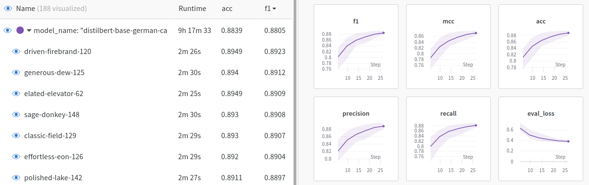
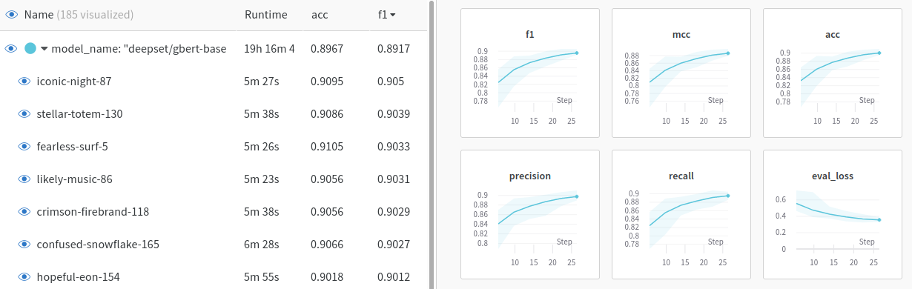

# Ten Thousand German News Articles from "DER STANDARD"

<div align="center">
  <br>
</div>

## About

**Goal:** Implement a state-of-the-art text classifier using Transfer Learning with pretrained German Transformer Models.

### Dataset
We will be using the [Ten Thousand German Newspaper Article Dataset](https://tblock.github.io/10kGNAD/) (10kGNAD). It contains 10,273 German-language news articles, which are categorized into 9 topics. The source of the news articles is the [One Million Posts Corpus](https://ofai.github.io/million-post-corpus/) which mainly focuses on user comments posted on the Austrian newspaper website [DER STANDARD](http://derstandard.at/). But it also includes the original news arcticles along with some meta data. Fortunately, all articles have been extracted, cleaned and prepared for text classification in the [10kGNAD respository](https://github.com/tblock/10kGNAD) on Github.


### Quick Setup

1. Create Virtual Environment

```console
foo@bar:~$ python3 -m venv venv
foo@bar:~$ source venv/bin/activate
foo@bar:~$ pip install --upgrade -r requirements.txt
```

2. Start Jupyter Lab

```console
foo@bar:~$ jupyter lab
```

## Explorative Data Analysis

All work is done in Jupyter notebooks.

### Basic Data Exploration

Get some descriptive statistics about the news article dataset ([Notebook](10_data_analysis.ipynb)).

* Number and length of articles
* Names and distribution of categories


### Clustering of Articles (TODO)

Using ...

## Transfer Learning with Pretrained German Language Models


### Preliminary: Understanding Tokenization of German Texts

* Compare tokenization of different pretrained German Transformer models ([Notebook](colab/20_transformer_tokenization.ipynb))


### 1. Using SimpleTransformers

SimpleTransformers is an great library which wraps around the excellent HuggingFace Transformer implementation and makes it very easy to train state-of-the-art NLP Models with just a few lines of code. Moreover, it directly integrated with Weights & Biases for evaluation of model performance.

#### PART I: DistilBERT

DistilBERT models are smaller and faster than BERT models. Thus it is the ideal model to use for quick experimentation with training parameters.

1. Train a basic topic classifier based on a pretrained German DistilBert language model using the sensible default settings of SimpleTransformers. ([Notebook](colab/21_10kGNAD_simpletransformers_default_distilbert.ipynb))
3. Using hyperparameter optimization to improve the model performance. ([Notebook](colab/22_10kGNAD_simpletransformers_hyperparam_distilbert.ipynb))
4. Using advanced hyperparameter optimization to further improve the model performance. ([Notebook](colab/23_10kGNAD_simpletransformers_advanced_hyperparam_distilbert.ipynb))

<div align="center">
  <br>
  <span><a href="https://wandb.ai/goerlitz/10kGNAD_SimpleTransformers_base">Training runs with default SimpleTransformers settings and pretrained DistilBERT model.</a></span>
  <br>
  <span><a href="https://wandb.ai/goerlitz/10kGNAD_SimpleTransformers_bert_default">Training runs with default SimpleTransformers settings and pretrained BERT model.</a></span>
</div>


#### PART II: Comparing Different Pretrained German Transformer Models

* Using different pretrained German Language Models and compare their performance. ([Notebook](colab/24_10kGNAD_simpletransformers_compare_pretrained_models.ipynb))


#### PART III: BERT

1. Train a basic topic classifier based on a pretrained German Bert language model using the sensible default settings of SimpleTransformers. ([Notebook](colab/25_10kGNAD_simpletransformers_default_bert.ipynb))

### 2. Using Farm

Farm is another library that simplifies training of Transformer models by wrapping setup details of the Hugginface Transformer library.

* Train a topic classifier with a default Farm Transformer setup (pretrained German BERT model) ([Notebook](colab/22_default_farm_classifier.ipynb))


### 3. Using Vanilla HuggingFace

* Train a topic classifier with a default Hugginface Transformer setup (pretrained German BERT model) ([Notebook](colab/23_default_huggingface_classifier.ipynb))


### Using FastAI (ULMFit)

* Train classifier on a pretrained German FastAI Language Model
