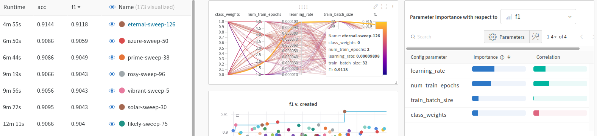

# Ten Thousand German News Articles from "DER STANDARD"

<div align="center">
  <br>
</div>

## About

**Goal:** Implement a state-of-the-art text classifier using Transfer Learning with pretrained German Transformer Models.

### Dataset
We will be using the [Ten Thousand German Newspaper Article Dataset](https://tblock.github.io/10kGNAD/) (10kGNAD). It contains 10,273 German-language news articles, which are categorized into 9 topics. The source of the news articles is the [One Million Posts Corpus](https://ofai.github.io/million-post-corpus/) which mainly focuses on user comments posted on the Austrian newspaper website [DER STANDARD](http://derstandard.at/). But it also includes the original news arcticles along with some meta data. Fortunately, all articles have been extracted, cleaned and prepared for text classification in the [10kGNAD respository](https://github.com/tblock/10kGNAD) on Github.


### Requirements

* [Huggingface Transformers](https://huggingface.co/transformers/) implementation
* [SimpleTransformers](https://simpletransformers.ai/) library
* [Google Colab](https://colab.research.google.com/) or other compute instance with GPU support
* [Weights & Biases](https://wandb.ai/) for experiment tracking

### References

* https://towardsdatascience.com/hyperparameter-optimization-for-optimum-transformer-models-b95a32b70949


### Quick Setup

1. Create Virtual Environment

```console
foo@bar:~$ python3 -m venv venv
foo@bar:~$ source venv/bin/activate
foo@bar:~$ pip install --upgrade -r requirements.txt
```

2. Start Jupyter Lab

```console
foo@bar:~$ jupyter lab
```

## Explorative Data Analysis

All work is done in Jupyter notebooks.

### Basic Data Exploration

Get some descriptive statistics about the news article dataset ([Notebook](10_data_analysis.ipynb)).

* Number and length of articles
* Names and distribution of categories


### Clustering of Articles (TODO)

Using ...

## Transfer Learning with Pretrained German Language Models


### Preliminary: Understanding Tokenization of German Texts

* Compare tokenization of different pretrained German Transformer models ([Notebook](colab/20_transformer_tokenization.ipynb))


### 1. Using SimpleTransformers

SimpleTransformers is an great library which wraps around the excellent HuggingFace Transformer implementation and makes it very easy to train state-of-the-art NLP Models with just a few lines of code. Moreover, it directly integrated with Weights & Biases for evaluation of model performance.

#### PART I: SimpleTransformers with Default Settings

The SimpleTransformers implementation comes with sensible default settings for hyperparameters like *learning rate*. Hence, we can quickly implement and train a classifier with good performance without the need to search for recommended parameter settings for each used model.

The notebook can be configured to use any pretrained German language model. It will train a classifier multiple times with the same settings and collect all parameters and evaluation results in a Weigths & Biases project. ([Notebook](colab/21_10kGNAD_simpletransformers_default_distilbert.ipynb))

<div align="center">
  <pre>distilbert-base-german-cased</pre>
  
</div>
<p>DistilBERT models are smaller and faster than BERT models while still achieving a high accuracy. Thus, they are ideal for quick experiments with different parameters.
The best DistilBERT model of <a href="https://wandb.ai/goerlitz/10kGNAD_SimpleTransformers_base">all training runs</a> has an accuracy of <b>89.5%</b> and f1 of <b>89.2%</b>.
</p>
</div>
<div align="center">
  <pre>deepset/gbert-base</pre>
  <br>
</div>
<p>The best BERT model of all <a href="https://wandb.ai/goerlitz/10kGNAD_SimpleTransformers_bert_default">all training runs</a> has an accuracy of <b>91.0%</b> and f1 of <b>90.5%</b>.
</p>
<div align="center">
  <pre>deepset/gelectra-large</pre>
  
</div>
<p>The best Electra model of all <a href="">all training runs</a> has an accuracy of <b>90.4%</b> and f1 of <b>90.0%</b>.


#### PART II: SimpleTransformers with Hyperparameter Optimization

Next, we try to achieve higher model performance by finding the best hyperparater combination. This [Notebook](colab/22_10kGNAD_simpletransformers_hyperparam_distilbert.ipynb) uses the sweeps feature of Weights & Biases (and its excellent integration in SimpleTransformers) to search for the best value regarding **learning rate**, **training epochs**, **batch size**, **class weights**

  
<div align="center">
  <pre>distilbert-base-german-cased</pre>
  
</div>
<p>The best DistilBERT model of all <a href="">all training runs</a> has an accuracy of <b>90.4%</b> and f1 of <b>90.1%</b>.
<div align="center">
  <pre>deepset/gbert-base</pre>
  
</div>
<p>The best BERT model of all <a href="">all training runs</a> has an accuracy of <b>91.4%</b> and f1 of <b>91.2%</b>.


#### PART III: SimpleTransformers with Advanced Hyperparameter Optimization

([Notebook](colab/23_10kGNAD_simpletransformers_advanced_hyperparam_distilbert.ipynb))


#### PART IV: Comparing Different Pretrained German Transformer Models

* Using different pretrained German Language Models and compare their performance. ([Notebook](colab/24_10kGNAD_simpletransformers_compare_pretrained_models.ipynb))


### 2. Using Farm

Farm is another library that simplifies training of Transformer models by wrapping setup details of the Hugginface Transformer library.

* Train a topic classifier with a default Farm Transformer setup (pretrained German BERT model) ([Notebook](colab/22_default_farm_classifier.ipynb))


### 3. Using Vanilla HuggingFace

* Train a topic classifier with a default Hugginface Transformer setup (pretrained German BERT model) ([Notebook](colab/23_default_huggingface_classifier.ipynb))


### Using FastAI (ULMFit)

* Train classifier on a pretrained German FastAI Language Model
